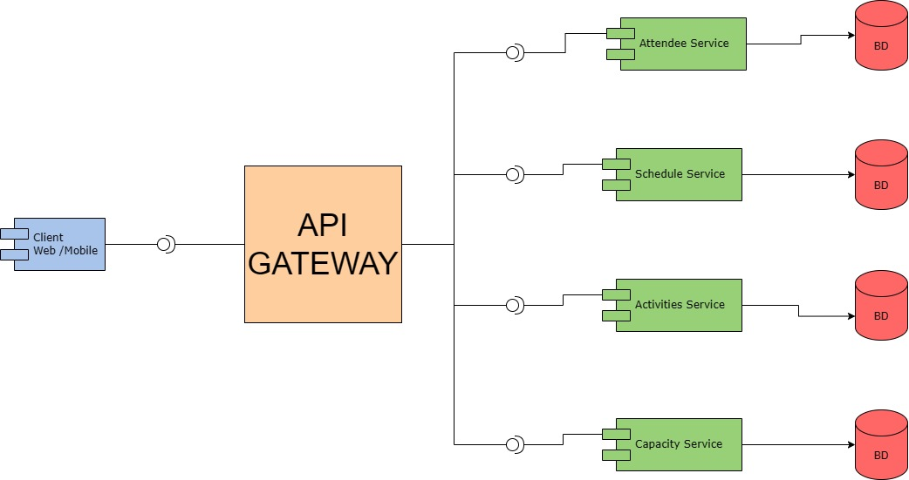

# LAB3 Part 2 ARSW-I — gRPC, Microservices and API Gateway

**Juan Esteban Rodríguez**

## Overview

This laboratory explores modern communication mechanisms used in distributed architectures through the implementation of a University Wellness System.

The workshop is divided into three stages:

1. University Wellness Appointment Management using gRPC.
2. Decomposition of the system into Microservices.
3. Integration of services through an API Gateway.
4. Final exercise of Integration with **ECICIENCIA** platform

The objective is to understand how service contracts, remote procedure calls, microservice decomposition, and gateway patterns can be used to build scalable distributed systems.

---

# Part I — University Wellness Management using gRPC

## Description

This implementation uses gRPC and Protocol Buffers to manage university wellness appointments.

The communication contract is defined in a `.proto` file, from which Java classes are automatically generated for both the client and the server.

The service provides three remote procedures:

* RequestAppointment
* CancelAppointment
* GetAppointments

Appointments are stored in memory and can be created, queried, and cancelled by students.

The use of gRPC allows strongly typed communication and language-independent service definitions.

## How to Run

Compile the project:

```bash
mvn clean compile
```

Run the server:

```bash
mvn exec:java -Dexec.mainClass=edu.eci.arsw.wellbeing.AppointmentGrpcServer
```

In another terminal, run the client:

```bash
mvn exec:java -Dexec.mainClass=edu.eci.arsw.wellbeing.AppointmentGrpcClient
```

## Evidence


## Reflection Questions

### Why is the .proto file considered a contract?

Because it formally defines the operations offered by the service, the request and response messages, and the data types exchanged between client and server. Both parties must follow this specification to communicate successfully.

### How easy would it be to create a client in another language?

Very easy. The same `.proto` file can generate client code for Java, Python, Go, C++, JavaScript, and many other languages without changing the service implementation.

### What differences do you find between RMI and gRPC?

RMI is Java-specific and relies on Java object serialization. gRPC is language-independent, uses Protocol Buffers for serialization, and is designed for modern distributed systems with better interoperability.

---

# Part II — University Wellness Microservices

## Description

The monolithic wellness system was decomposed into independent microservices.

Two services were implemented:

### AppointmentService

Responsible for:

* Creating appointments
* Cancelling appointments
* Retrieving student appointments

Runs on port:

```text
50051
```

### GymService

Responsible for:

* Reserving gym sessions
* Retrieving gym reservations

Runs on port:

```text
50053
```

Each service maintains its own data and business logic independently.

## How to Run

Compile:

```bash
mvn clean compile
```

Run AppointmentService:

```bash
mvn exec:java -Dexec.mainClass=edu.eci.arsw.wellbeing.AppointmentGrpcServer
```

Run GymService:

```bash
mvn exec:java -Dexec.mainClass=edu.eci.arsw.gym.GymGrpcServer
```

Run the client:

```bash
mvn exec:java -Dexec.mainClass=edu.eci.arsw.gym.WellnessClient
```

## Evidence


## Architecture Diagram


## Reflection Questions

### Why were these services separated?

Because appointment management and gym reservations belong to different business domains. Separating them reduces coupling and allows each service to evolve independently.

### What data belongs to each service?

AppointmentService stores appointment information, while GymService stores reservation information.

### What risk appears when the client knows all services?

The client becomes tightly coupled to service locations and ports. Any change in service deployment may require modifications in all clients.

---

# Part III — Wellness API Gateway

## Description

To reduce client coupling, a WellnessGateway service was introduced.

Instead of communicating directly with multiple microservices, clients interact with a single entry point.

The gateway forwards requests to the appropriate service and returns the corresponding response.

The gateway hides the internal service structure from clients.

## How to Run

Run AppointmentService:

```bash
mvn exec:java -Dexec.mainClass=edu.eci.arsw.wellbeing.AppointmentGrpcServer
```

Run GymService:

```bash
mvn exec:java -Dexec.mainClass=edu.eci.arsw.gym.GymGrpcServer
```

Run WellnessGateway:

```bash
mvn exec:java -Dexec.mainClass=edu.eci.arsw.gateway.WellnessGatewayServer
```

Run the gateway client:

```bash
mvn exec:java -Dexec.mainClass=edu.eci.arsw.gateway.WellnessGatewayClient
```

## Evidence


## Reflection Questions

### What advantage does the Gateway offer to clients?

Clients only need to know a single endpoint and do not need information about the internal microservice architecture.

### What new responsibility does the Gateway assume?

The Gateway becomes responsible for request routing, service orchestration, and centralizing access to backend services.

### What would happen if a new service were added?

Only the Gateway would need to be updated. Existing clients could continue using the same endpoint without modifications.

---

# Part IV — Eciciencia Platform

## Architecture Diagram




## List of services and responsibilities

### AttendeeService

#### Responsibilities
- Register event attendees.
- Retrieve attendee information.

#### Managed Data
- id
- name
- institutionalEmail

#### Operations
- RegisterAttendee
- GetAttendee

### ScheduleService

#### Responsibilities
- Manage the ECICIENCIA agenda.
- Retrieve available activities.
- Search activities by time slot.

#### Managed Data
- activityId
- title
- speaker
- startTime
- endTime
- location

#### Operations
- GetSchedule
- GetActivitiesByTimeSlot

### ActivitiesService

#### Responsibilities
- Manage workshop reservations.
- Associate attendees with activities.

#### Managed Data
- reservationId
- attendeeId
- activityId
- reservationStatus

#### Operations
- ReserveWorkshop
- CancelReservation
- GetReservations

### CapacityService

#### Responsibilities
- Control the capacity of each activity.
- Verify availability before confirming a reservation.

#### Managed Data
- activityId
- capacity
- reservedSeats
- availableSeats

#### Operations
- CheckCapacity
- UpdateCapacity

## Proposed gRPC Contract

```proto
syntax = "proto3";

option java_multiple_files = true;
option java_package = "edu.eci.arsw.eciciencia";
option java_outer_classname = "ECICIENCIAProto";

service ActivitiesService {

  rpc ReserveActivity(ActivityRequest)
      returns (ActivityResponse);

  rpc CancelReservation(CancelRequest)
      returns (CancelResponse);

  rpc GetReservations(AttendeeRequest)
      returns (ReservationList);
}

message ActivityRequest {
  int32 attendeeId = 1;
  int32 activityId = 2;
}

message ActivityResponse {
  int32 reservationId = 1;
  bool success = 2;
}

message CancelRequest {
  int32 reservationId = 1;
}

message CancelResponse {
  bool success = 1;
}

message AttendeeRequest {
  int32 attendeeId = 1;
}

message Reservation {
  int32 reservationId = 1;
  int32 attendeeId = 2;
  int32 activityId = 3;
  string status = 4;
}

message ReservationList {
  repeated Reservation reservations = 1;
}

```

## API Gateway Description

The ECICIENCIA Gateway acts as the single entry point for all clients.

### Responsibilities
- Receive requests from web and mobile applications.
- Route requests to the appropriate microservice.
- Hide the internal architecture from clients.
- Centralize validation and future security mechanisms.
- Allow new services to be added without modifying client applications.

Examples:

- Agenda queries are forwarded to the ScheduleService.
- Workshop reservations are forwarded to the WorkshopService.
- Before confirming a reservation, the Gateway communicates with the CapacityService to verify seat availability.

## Why not use a Monolitic Architecture?

Implementing the entire platform as a single monolithic service would create strong coupling between different business domains.

Attendee management, agenda management, workshop reservations, and capacity control have distinct responsibilities and evolve independently.

A change in the reservation module could require redeploying the entire application. Furthermore, scalability would be inefficient because some modules, such as schedule queries, may receive significantly more traffic than others.

A microservices architecture provides several advantages:

- Separation of responsibilities.
- Lower coupling between modules.
- Independent deployment.
- Individual scalability for each service.
- Better maintainability.
- Easier integration of new services.

For these reasons, a microservices architecture is more suitable for the ECICIENCIA platform.

---

# Conclusions

This laboratory demonstrated the evolution from a simple RPC service to a microservice-based architecture and finally to an API Gateway pattern.

gRPC provides efficient communication through Protocol Buffers and strongly typed contracts. Microservices improve modularity and scalability by separating business responsibilities. Finally, the API Gateway simplifies client interaction and reduces coupling by exposing a unified entry point to the system.


